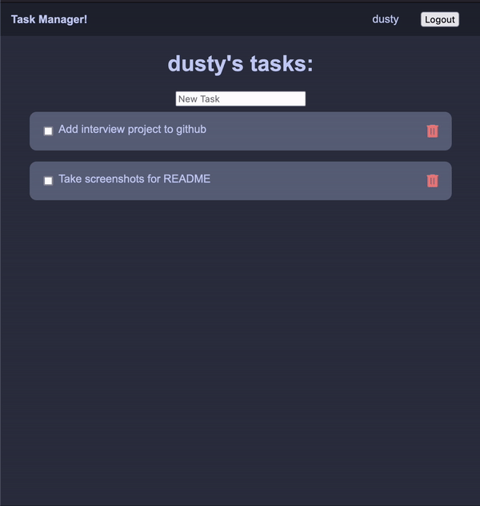

# Intro

This was a project I did as part of the interview process for an undisclosed company! I created a new repository to remove proprietary information without going through the trouble to remove stuff from the git history.

Here's what it looks like!

# Running the application

First and foremost, here's how to run the build image for the full stack of this application! The UI is already built and bundled into the server.

-   `docker compose build`
-   `docker compose up`
-   open [localhost:3000](http://localhost:3000)

# Building

There are a few brief steps to building the app:

-   From the `client/tasks` directory, run:
    -   `npm install` (if you have not already done so)
    -   `npm run build`
    -   Copy the contents from the `client/tasks/dist` directory to `server/src/public/client/dist/`
-   From here, follow the steps above for "Running the application"

# Development

DB:

-   `docker compose up -d mongodb`

Client:

- `npm i`
-   `npm run start`

Server:

- `npm i`
-   `npm run start`

# Development Notes

I did run out of time before having a chance to make some of these changes, so I wanted to document some things I would refactor or do a little bit differently in the future.

## Backend

### What I would do differently: 
-   I would utilize an ODM, such as [Mongoose](https://mongoosejs.com/)
-   refactor the logic out of the routes and into a service layer
-   In `tasks.mjs`, I should have returned the updated or inserted task object for the POST and PUT endpoints
-   The first GET endpoint in `tasks.mjs` should indicate that it's only returning completed statuses for the user.
-   I'd also probably do this in TypeScript

## Database

The collection structure is documented in `./db/README.md`

### What I would do differently:

-   `createdBy` should be a reference to the `Users` collection
-   Add a TaskList collection as an in-between for tasks and users, it would look something like this:

| Field | Type             | Description                               |
| ----- | ---------------- | ----------------------------------------- |
| id    | ObjectId         | id of the TaskList                        |
| user  | ObjectId         | reference to the user the list belongs to |
| tasks | List\<ObjectId\> | A list of references to the tasks         |

> This would still retain task order and we wouldn't have to make a weird call to GET user in order to get tasks

## Frontend

All functionality described in the instructions works! Please note that you are able to drag and drop tasks to re-organize them as well!

### What I would do differently:

-   Make each task card it's own component and move drag + drop methods into that component
-   API should return newly added/updated task instead of needing to call getUser to update the task, but I ran out of time to fix this

## Color Scheme Credit

I used some colors from [Catppuccin](https://github.com/catppuccin/catppuccin)!
